# UI Flow: Agent Runner

Authoritative reference for all screens, routes, API calls, WebSocket connections, state transitions, and field validations in the Agent Runner application.

## Main Flow Diagram

```mermaid
flowchart TD
    %% ===== SCREENS =====
    DASH["#/ Dashboard"]
    NEW["#/new New Project"]
    PROJ["#/projects/:id Project Detail"]
    SESS["#/sessions/:id Session View"]
    FEAT["#/projects/:id/add-feature Add Feature"]
    SETT["#/settings Settings"]

    %% ===== SHARED INLINE COMPONENTS =====
    GITMODAL_DASH["GitRemoteModal (inline in Dashboard)"]
    GITMODAL_NEW["GitRemoteModal (inline in New Project)"]
    SKCHAT_FEAT["SpecKitChat (inline in Add Feature)"]

    %% ===== NAVIGATION TRANSITIONS =====
    DASH -- "Click '+ New Project'" --> NEW
    DASH -- "Click project card" --> PROJ
    DASH -- "Click Settings (header)" --> SETT
    DASH -- "Click 'Onboard' on discovered dir" --> GITMODAL_DASH
    GITMODAL_DASH -- "Select remote option, confirm\nPOST /api/projects/onboard → 201" --> DASH

    NEW -- "Enter name, select remote option\nPOST /api/projects/onboard → 201" --> DASH
    NEW -- "Back (header)" --> DASH

    PROJ -- "Click 'View Session'" --> SESS
    PROJ -- "Click 'Add Feature'" --> FEAT
    PROJ -- "Back (header)" --> DASH

    FEAT -- "POST /api/projects/:id/add-feature → 201" --> SKCHAT_FEAT
    SKCHAT_FEAT -- "Phase reaches 'implementation' (auto-nav 2s)" --> PROJ

    SESS -- "Back (header)" --> PROJ
    SETT -- "Back (header)" --> DASH
    FEAT -- "Back (header)" --> PROJ

    %% ===== ON-LOAD API CALLS =====
    DASH -. "GET /api/projects" .-> DASH
    PROJ -. "GET /api/projects/:id" .-> PROJ
    SESS -. "GET /api/sessions/:id" .-> SESS
    SESS -. "GET /api/sessions/:id/log" .-> SESS
    SETT -. "GET /api/health" .-> SETT

    %% ===== WEBSOCKET CONNECTIONS =====
    DASH == "WS /ws/dashboard\n(project-update, onboarding-step)" ==> DASH
    SESS == "WS /ws/sessions/:id?lastSeq=N\n(output, state, progress)" ==> SESS
    SKCHAT_FEAT == "WS /ws/sessions/:sessionId\n(output, state, phase)" ==> SKCHAT_FEAT

    %% ===== USER ACTIONS (non-navigation) =====
    PROJ -- "Click 'Start Task Run'\nPOST /api/projects/:id/sessions" --> SESS
    PROJ -- "Click 'Stop'\nPOST /api/sessions/:id/stop" --> PROJ
    SESS -- "Submit input\nPOST /api/sessions/:id/input" --> SESS
    SESS -- "Click 'Enable Notifications'\nGET /api/push/vapid-key\nPOST /api/push/subscribe" --> SESS
    SETT -- "Change log level\nPUT /api/config/log-level" --> SETT

    %% ===== ERROR PATHS =====
    NEW -- "POST → 400 (validation)\nor 409 (duplicate)" --> NEW
    FEAT -- "POST → 400 / 404 / 409" --> FEAT
    PROJ -- "Start → 400 / 409 / 503" --> PROJ
    SESS -- "Input → 400 / 404" --> SESS

    %% ===== ANDROID NATIVE SCREENS =====
    SCONF["ServerConfigActivity\n(Android native)"]
    KEYMGMT["KeyManagementActivity\n(Android native)"]
    SIGNDLG["SignRequestDialog\n(Android modal)"]

    %% ===== ANDROID NAVIGATION =====
    SCONF -- "Enter URL, tap Connect\nSave to SharedPreferences" --> DASH
    DASH -- "window.AgentRunner.openSettings()" --> SCONF
    DASH -- "window.AgentRunner.openKeyManagement()" --> KEYMGMT
    KEYMGMT -- "Back (toolbar)" --> DASH

    %% ===== ANDROID SSH SIGN FLOW =====
    SESS -- "WS ssh-agent-request\n(Android only)" --> SIGNDLG
    SIGNDLG -- "User signs (PIN/biometric/auto)\nWS ssh-agent-response" --> SESS
    SIGNDLG -- "User cancels\nWS ssh-agent-cancel" --> SESS

    %% ===== STYLING =====
    classDef screen fill:#e1f5fe,stroke:#0288d1,stroke-width:2px
    classDef inline fill:#fff3e0,stroke:#f57c00,stroke-width:2px
    classDef android fill:#e8f5e9,stroke:#388e3c,stroke-width:2px
    class DASH,NEW,PROJ,SESS,FEAT,SETT screen
    class GITMODAL_DASH,GITMODAL_NEW,SKCHAT_FEAT inline
    class SCONF,KEYMGMT,SIGNDLG android
```

### Legend

| Style | Meaning |
|-------|---------|
| Solid arrow (`-->`) | User-triggered navigation or action |
| Dotted arrow (`-.->`) | On-load API call (GET) |
| Double-line arrow (`==>`) | WebSocket connection (persistent) |
| Blue boxes | Top-level screens (hash routes) |
| Orange boxes | Inline components (no route change) |
| Green boxes | Android native screens (Activities/Dialogs) |

### Session State Machine

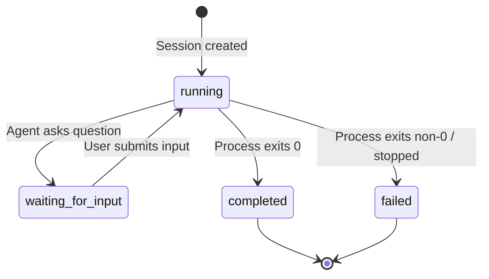

### Project Status State Machine

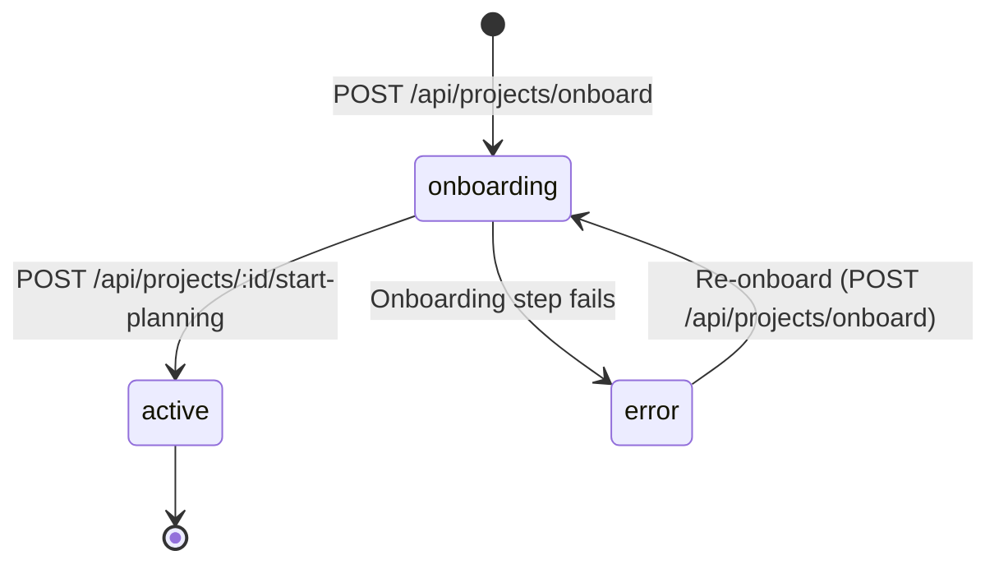

### Spec-Kit Workflow Phases

#### Onboarding (New Project / Discovered Directory)

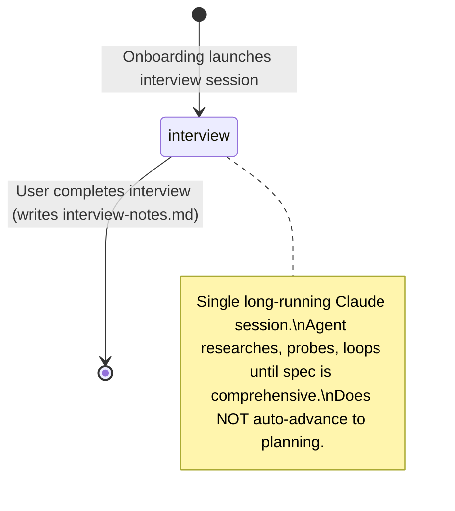

#### Planning (Triggered by User)

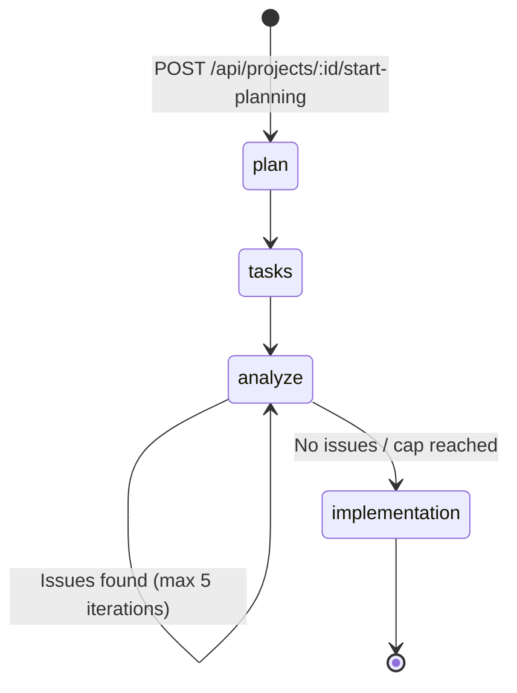

#### Add Feature

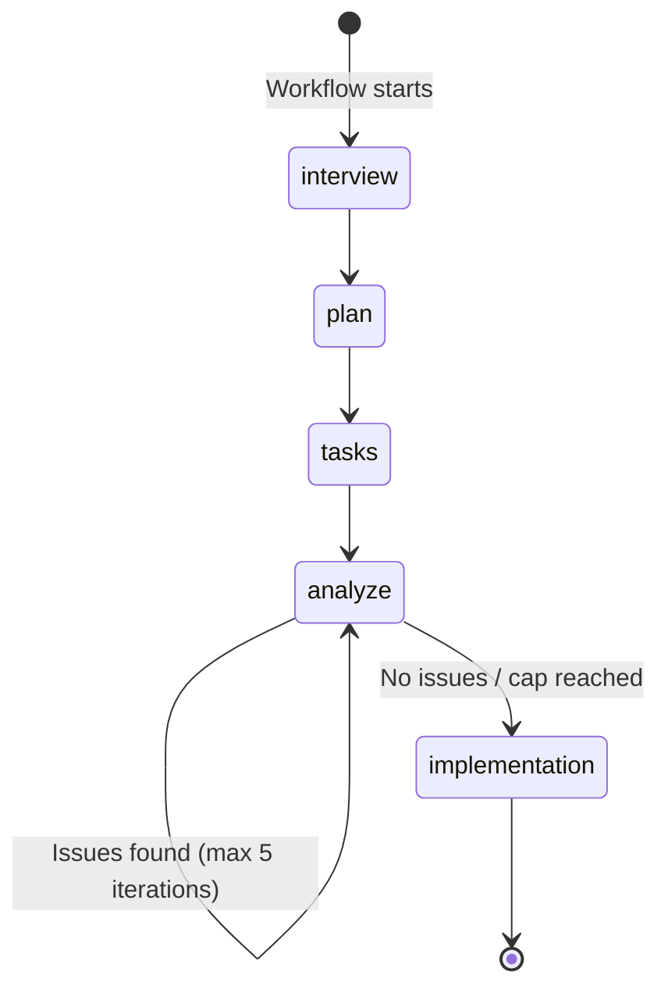

### API Endpoint Summary

| Method | Path | Used By | Purpose |
|--------|------|---------|---------|
| GET | `/api/health` | Settings | Server health, sandbox/STT availability |
| PUT | `/api/config/log-level` | Settings | Update server log level |
| GET | `/api/projects` | Dashboard | List all projects with task summaries |
| POST | `/api/projects` | (admin) | Register existing project directory |
| POST | `/api/projects/onboard` | Dashboard, NewProject | Unified onboarding for discovered dirs and new projects |
| GET | `/api/projects/:id` | ProjectDetail | Full project info with tasks/sessions |
| DELETE | `/api/projects/:id` | (admin) | Unregister project |
| POST | `/api/projects/:id/sessions` | ProjectDetail | Start task-run or interview session |
| GET | `/api/projects/:id/sessions` | (API) | List sessions for a project |
| POST | `/api/projects/:id/add-feature` | AddFeature | Start add-feature workflow |
| POST | `/api/projects/:id/start-planning` | (API/UI) | Trigger interview-to-planning transition |
| ~~POST~~ | ~~`/api/workflows/new-project`~~ | ~~Removed~~ | ~~Returns 410 Gone. Use `/api/projects/onboard` with `newProject: true`~~ |
| GET | `/api/sessions/:id` | SessionView | Fetch session metadata |
| GET | `/api/sessions/:id/log` | SessionView | Fetch session log entries |
| POST | `/api/sessions/:id/stop` | ProjectDetail | Stop a running session |
| POST | `/api/sessions/:id/input` | SessionView | Submit input to waiting session |
| GET | `/api/push/vapid-key` | SessionView | Get VAPID public key |
| POST | `/api/push/subscribe` | SessionView | Subscribe to push notifications |
| POST | `/api/voice/transcribe` | (voice cloud) | Cloud speech-to-text transcription |

### WebSocket Paths

| Path | Used By | Messages Received |
|------|---------|-------------------|
| `/ws/dashboard` | Dashboard | `project-update` (projectId, activeSession, taskSummary, workflow), `onboarding-step` (projectId, step, status, error) |
| `/ws/sessions/:id` | SessionView, SpecKitChat | `output`, `state`, `progress`, `phase`, `sync`, `error`, `ssh-agent-request` (server→client) |

---

## Screen-by-Screen Details

### Dashboard (`#/`)

**Route**: `#/` (default)
**Component**: `src/client/components/dashboard.tsx`

**On Load**:
- `GET /api/projects` — fetches all projects (registered and discovered) with task summaries and active session info

**User Actions**:
| Element | Action | Result |
|---------|--------|--------|
| "+ New Project" link | Click | Navigate to `#/new` |
| Project card (registered) | Click | Navigate to `#/projects/:id` |
| "Onboard" button (discovered dir) | Click | Opens GitRemoteModal — user selects skip/URL/GitHub, then `POST /api/projects/onboard` |
| Settings icon (header) | Click | Navigate to `#/settings` |

**Field Validations**: None (read-only screen except for onboard modal)

**Real-time Updates**:
- WebSocket `/ws/dashboard` — receives:
  - `project-update` messages containing:
    - `projectId`: which project changed
    - `activeSession`: current session state (id, type, state) or null
    - `taskSummary`: updated task counts (total, completed, blocked, skipped, remaining)
    - `workflow`: current workflow info (type, phase, iteration, description) or null
  - `onboarding-step` messages containing:
    - `projectId`: which project is being onboarded
    - `step`: current step name (`register`, `create-directory`, `generate-flake`, `git-init`, `git-remote`, `install-specify`, `specify-init`, `launch-interview`)
    - `status`: step outcome (`running`, `completed`, `skipped`, `error`)
    - `error`: error message if status is `error`, null otherwise

**Navigation Out**:
- `#/new` — create new project
- `#/projects/:id` — view project details
- `#/settings` — app settings

**Error States**:
- API fetch failure — error message displayed inline
- WebSocket disconnect — auto-reconnect with exponential backoff (500ms → 30s); non-fatal
- Onboard failure — error surfaced via `onboarding-step` WebSocket message with `status: "error"`

---

### New Project (`#/new`)

**Route**: `#/new`
**Component**: `src/client/components/new-project.tsx`

**On Load**: None

**User Actions**:
| Element | Action | Result |
|---------|--------|--------|
| "Repository name" text input | Type | Sets `name` state |
| Git remote option (skip / URL / GitHub) | Select | Sets remote config for onboard request |
| "Go" button | Click | `POST /api/projects/onboard` with `{ name, newProject: true, remoteUrl?, createGithubRepo? }` → navigate to `#/` |
| Back (header) | Click | Navigate to `#/` |

**Field Validations**:
- `name`: required, non-empty (button disabled until filled)
- Server-side: name must match `/^[a-zA-Z0-9._-]+$/`, must not be duplicate in registry or on disk

**Real-time Updates**: None — navigates to dashboard on success, where `onboarding-step` WebSocket messages show progress.

**Navigation Out**:
- `#/` — back via header or on successful onboard submission

**Error States**:
- 400 — validation error (empty name, invalid chars) — displayed inline
- 409 — duplicate project name or directory exists — displayed inline

---

### Project Detail (`#/projects/:id`)

**Route**: `#/projects/:id`
**Component**: `src/client/components/project-detail.tsx`

**On Load**:
- `GET /api/projects/:id` — fetches project with tasks, sessions, task summary, active session

**User Actions**:
| Element | Action | Result |
|---------|--------|--------|
| "Start Task Run" button | Click | `POST /api/projects/:id/sessions` with `{ type: "task-run" }` → navigate to `#/sessions/:newId` |
| "Stop" button | Click | `POST /api/sessions/:id/stop` → session marked failed |
| "View Session" button | Click | Navigate to `#/sessions/:id` |
| "Add Feature" button | Click | Navigate to `#/projects/:id/add-feature` |
| Back (header) | Click | Navigate to `#/` |

**Field Validations**:
- "Start Task Run" disabled when `taskSummary.remaining === 0`
- "Stop" only visible when `activeSession.state === 'running'`

**Real-time Updates**: None (uses polling via `fetchProject()` after actions)

**Navigation Out**:
- `#/` — back to dashboard
- `#/sessions/:id` — view session (via "View Session" or after starting task run)
- `#/projects/:id/add-feature` — add feature workflow

**Error States**:
- 404 — project not found
- 400 — no unchecked tasks remaining (for start)
- 409 — project already has active session (for start)
- 503 — sandbox unavailable (for start)
- Stop errors displayed inline

---

### Session View (`#/sessions/:id`)

**Route**: `#/sessions/:id`
**Component**: `src/client/components/session-view.tsx`

**On Load**:
- `GET /api/sessions/:id` — fetch session metadata (state, type, projectId, question, etc.)
- `GET /api/sessions/:id/log` — fetch existing log entries before WebSocket subscription

**User Actions**:
| Element | Action | Result |
|---------|--------|--------|
| "Enable Notifications" button | Click | `GET /api/push/vapid-key` → browser `Notification.requestPermission()` → `POST /api/push/subscribe` |
| Answer text input + Enter / "Submit" | Submit | `POST /api/sessions/:id/input` with `{ answer }` |
| Scroll output area | Scroll up | Disables auto-scroll; auto-scroll re-enables at bottom |

**Field Validations**:
- Answer input: required, non-empty after trim
- Submit disabled when input empty or already submitting

**Real-time Updates**:
- WebSocket `WS /ws/sessions/:id?lastSeq=N`
- Receives:
  - `output` — log lines (seq, timestamp, stream: stdout/stderr/system, content)
  - `state` — session state changes (state, question, taskId)
  - `progress` — task summary updates
  - `sync` — sequence sync after replay
  - `ssh-agent-request` — SSH signing/key-listing request from sandboxed agent (see SSH Agent Bridge section)
- Sends:
  - `ssh-agent-response` — user-authorized SSH agent response (base64-encoded)
  - `ssh-agent-cancel` — user-cancelled SSH agent request

**Navigation Out**:
- `#/projects/:projectId` — back via header (uses projectId from session metadata)

**Error States**:
- 404 — session not found
- 400 — session not in waiting-for-input state (for input submission)
- 400 — empty answer
- Push notification: unsupported/denied/error states shown to user
- WebSocket disconnect — auto-reconnect with seq-based replay

---

### Add Feature (`#/projects/:id/add-feature`)

**Route**: `#/projects/:id/add-feature`
**Component**: `src/client/components/add-feature.tsx`

**On Load**: None

**User Actions**:
| Element | Action | Result |
|---------|--------|--------|
| "Describe the feature" textarea | Type | Sets `description` state |
| Mic button (M) | Click | Starts voice transcription → fills description field |
| "Add Feature" button | Click | `POST /api/projects/:id/add-feature` with `{ description }` |
| Back (header) | Click | Navigate to `#/projects/:id` |

**Field Validations**:
- `description`: required, non-empty (button disabled until filled)
- Server-side: project must exist, must not have active session

**Real-time Updates**:
- After workflow starts, transitions to inline SpecKitChat component
- SpecKitChat connects to `WS /ws/sessions/:sessionId`
- Receives: `output`, `state`, `phase` messages
- Phase indicator shows: interview → plan → tasks → analyze progression

**Navigation Out**:
- `#/projects/:id` — back via header
- `#/projects/:id` — auto-navigation when workflow phase reaches "implementation" (2s delay)

**Error States**:
- 400 — empty description — displayed inline
- 404 — project not found — displayed inline
- 409 — project already has active session — displayed inline
- 503 — sandbox unavailable — displayed inline
- Voice transcription failure — graceful fallback

---

### Settings (`#/settings`)

**Route**: `#/settings`
**Component**: `src/client/components/settings.tsx`

**On Load**:
- `GET /api/health` — fetch server status (uptime, sandboxAvailable, cloudSttAvailable)

**User Actions**:
| Element | Action | Result |
|---------|--------|--------|
| Voice backend radio (browser/cloud) | Select | Sets voice backend in voice.ts module state |
| Log level dropdown | Change | `PUT /api/config/log-level` with `{ level }` |
| "Enable Notifications" button | Click | `Notification.requestPermission()` (browser API) |
| Back (header) | Click | Navigate to `#/` |

**Field Validations**:
- Voice backend radio: "browser" disabled if `!isBrowserSpeechAvailable()`, "cloud" disabled if `!health.cloudSttAvailable`
- Log level: must be one of debug, info, warn, error, fatal

**Real-time Updates**: None

**Navigation Out**:
- `#/` — back to dashboard

**Error States**:
- Health fetch failure — error message, loading indicator persists
- Log level update failure — error displayed inline
- Push notification denied — status shown to user

---

### SpecKitChat (Shared Inline Component)

**Route**: None (inline within Add Feature)
**Component**: `src/client/components/spec-kit-chat.tsx`

**On Load**:
- Connects to `WS /ws/sessions/:sessionId` immediately

**User Actions**:
| Element | Action | Result |
|---------|--------|--------|
| Text input + Enter / "Send" button | Submit | Sends `{ type: "input", content }` via WebSocket |
| Mic button (M) | Click | Starts voice transcription → fills input field |
| Scroll output area | Scroll up | Disables auto-scroll |

**Field Validations**:
- Input: required, non-empty after trim
- Send disabled when input empty

**Real-time Updates**:
- WebSocket `WS /ws/sessions/:sessionId`
- Receives:
  - `output` — log lines with stream coloring (stdout=default, stderr=red, system=blue)
  - `state` — state changes; shows question banner when `waiting-for-input`
  - `phase` — phase transitions; updates phase indicator; may update sessionId for new phase session

**Navigation Out**:
- Parent screen's completion route when phase becomes "implementation" (2s auto-nav delay)

**Error States**:
- WebSocket disconnect — auto-reconnect with exponential backoff
- Message parse errors — silently ignored

---

### GitRemoteModal (Shared Inline Component)

**Route**: None (inline within Dashboard discovered cards and New Project)
**Component**: Defined locally in `src/client/components/dashboard.tsx` and `src/client/components/new-project.tsx`

**User Actions**:
| Element | Action | Result |
|---------|--------|--------|
| "Skip" button | Click | Proceeds with onboard without remote setup |
| "Remote URL" text input | Type + confirm | Sets `remoteUrl` on the onboard request |
| "Create GitHub Repo" button | Click | Sets `createGithubRepo: true` on the onboard request |
| Backdrop click | Click | Closes modal (cancel) |

**Field Validations**:
- Remote URL: optional, free-form text (validated server-side by git)
- `remoteUrl` and `createGithubRepo` are mutually exclusive (server-side validation)

---

## Android Native Screens

### Server Config (`ServerConfigActivity`)

**Component**: `android/app/src/main/kotlin/com/agentrunner/ServerConfigActivity.kt`

**On Load**:
- Pre-populates saved server URL from SharedPreferences (if previously configured)

**User Actions**:
| Element | Action | Result |
|---------|--------|--------|
| Server URL text input | Type | Sets server URL |
| "Connect" button | Click | Validates URL, saves to SharedPreferences, launches `MainActivity` with `EXTRA_SERVER_URL` |

**Field Validations**:
- Server URL: required, non-empty, must be valid HTTP/HTTPS URL
- Error cleared on text change

**Navigation Out**:
- `MainActivity` — on successful connect (clears task stack via `FLAG_ACTIVITY_CLEAR_TOP`)

**Error States**:
- Empty URL — inline error on TextInputLayout
- Invalid URL format — inline error on TextInputLayout

---

### Key Management (`KeyManagementActivity`)

**Component**: `android/app/src/main/kotlin/com/agentrunner/KeyManagementActivity.kt`

**On Load**:
- Reads all keys from `KeyRegistry` and displays in RecyclerView
- Starts Yubikey USB/NFC discovery (auto-registers detected Yubikey keys)

**User Actions**:
| Element | Action | Result |
|---------|--------|--------|
| "Add Yubikey" button | Click | Reads slot 9a from connected Yubikey, registers key in `KeyRegistry` |
| "Generate App Key" button | Click | AlertDialog for key name → generates ECDSA P-256 keypair in Android Keystore, registers in `KeyRegistry` |
| "Export" button (per key) | Click | Copies SSH public key (`ecdsa-sha2-nistp256 ...`) to clipboard |
| "Rename" button (per key) | Click | AlertDialog with name input → updates key name in `KeyRegistry` |
| "Remove" button (per key) | Click | Confirmation AlertDialog → removes from `KeyRegistry` (and Android Keystore if app key) |
| Back (toolbar) | Click | Returns to `MainActivity` |

**Field Validations**:
- Key name (generate): required, non-empty
- Key name (rename): required, non-empty

**Key List Item Display**:
- Key name (bold)
- Key type (`Yubikey PIV` / `App Key` / `Mock`)
- Fingerprint (truncated SHA-256)
- Last used timestamp

**Error States**:
- No Yubikey connected — "Add Yubikey" shows error toast
- Duplicate key (same public key blob) — rejected by `KeyRegistry`
- Keystore generation failure — error toast

---

### Sign Request Dialog (`SignRequestDialog`)

**Component**: `android/app/src/main/kotlin/com/agentrunner/bridge/SignRequestDialog.kt`

**Trigger**: Server sends `ssh-agent-request` message over WebSocket `/ws/sessions/:id`

**Display**:
- Operation context (e.g., "Sign request for git push to origin")
- Queue badge ("Request 1 of 3") when multiple requests pending

**User Actions**:
| Element | Action | Result |
|---------|--------|--------|
| Key picker (RadioGroup) | Select | Selects which key to use for signing (shown only when multiple keys match) |
| PIN input + "Sign" button | Submit | Sends PIN to `YubikeySigningBackend.signWithPin()` → signature sent via WebSocket |
| Biometric prompt | Authenticate | `KeystoreSigningBackend.sign()` uses Android BiometricPrompt → signature sent via WebSocket |
| "Cancel" button | Click | Sends `ssh-agent-cancel` → `SSH_AGENT_FAILURE` returned to agent |

**Key Picker Behavior**:
- 0 matching keys: legacy PIN-only mode (backward compatibility)
- 1 matching key: auto-selected, no picker shown
- Multiple matching keys: RadioGroup with status indicators per key

**Key Status Indicators**:
- "Ready" — key available for signing
- "Connect Yubikey" — Yubikey-backed key but no Yubikey connected
- "Unavailable" — key cannot sign (missing backend, missing alias)

**PIN Input**:
- Only shown for `YUBIKEY_PIV` keys when `pinRequired`
- Enter key submits PIN
- Wrong PIN: error message, input cleared, retry allowed
- PIN blocked (3 wrong attempts): shows blocked state, auto-dismisses after 3s

**Modal Behavior**:
- Non-cancellable via back press (`isCancelable = false`)
- Non-dismissible on outside touch
- User must explicitly tap "Cancel" to dismiss

**Error States**:
- Signing failure — error message displayed, auto-dismisses after 3s
- Yubikey disconnected during signing — request cancelled automatically
- 60s timeout — `SSH_AGENT_FAILURE` sent automatically

---

### JavaScript Bridge (`window.AgentRunner`)

**Component**: Inner class `AgentRunnerBridge` in `android/app/src/main/kotlin/com/agentrunner/MainActivity.kt`

Available only when the PWA runs inside the Android WebView (user agent contains `AgentRunner-Android`).

| Method | Returns | Purpose |
|--------|---------|---------|
| `openSettings()` | void | Launches `ServerConfigActivity` |
| `openKeyManagement()` | void | Launches `KeyManagementActivity` |
| `getYubikeyStatus()` | string | Returns `"connected_usb"`, `"connected_nfc"`, `"disconnected"`, or `"error"` |
| `getYubikeySerial()` | string | Returns empty string (serial shown in native overlay instead) |

**Detection**: PWA can check `typeof window.AgentRunner !== 'undefined'` to detect Android native context and show Android-specific UI elements (e.g., "Manage Keys" button).

---

## API Sequence Diagrams

### Unified Onboarding (New Project or Discovered Directory)

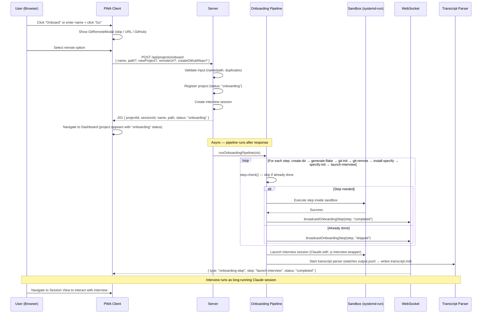

### Interview-to-Planning Handoff

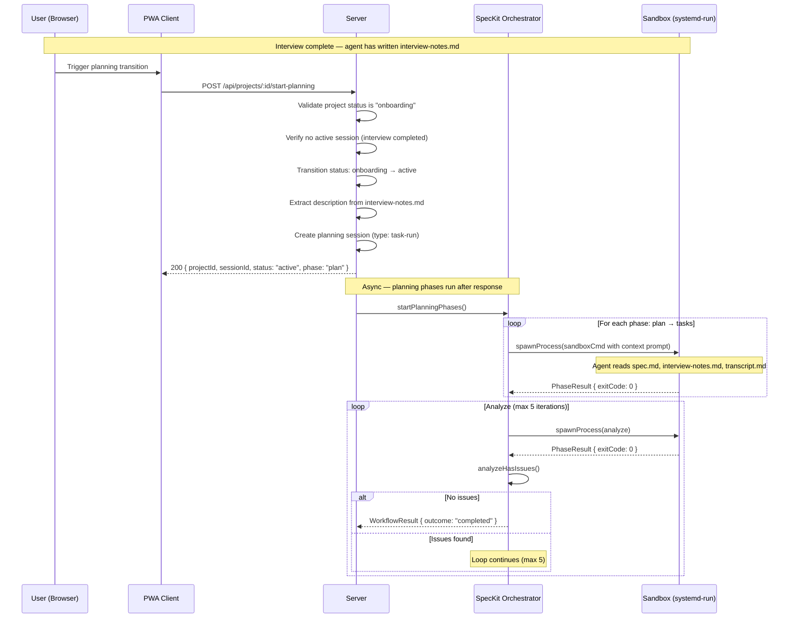

### Add Feature Workflow

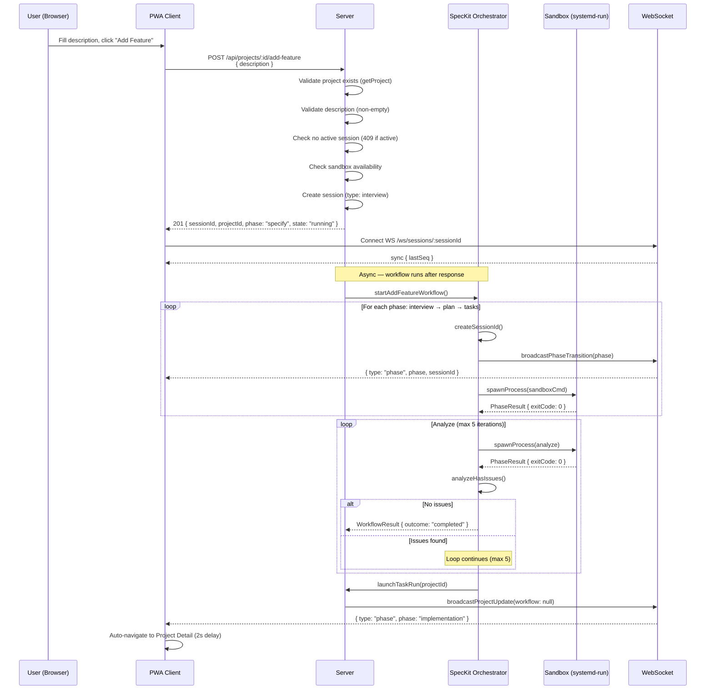

### Session Lifecycle

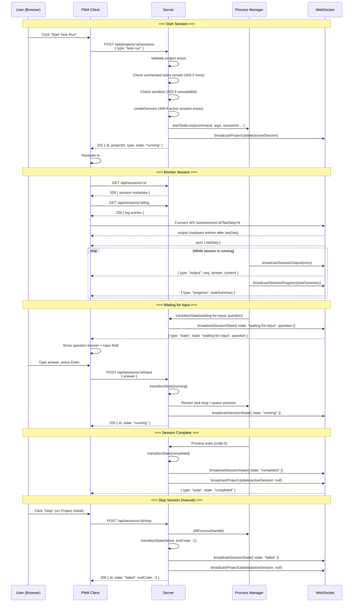

### SSH Agent Bridge Lifecycle

When a session's project has an SSH remote, the server creates an SSH agent bridge that relays signing requests from the sandboxed agent process to the WebSocket client.

```mermaid
sequenceDiagram
    participant A as Agent (Sandboxed)
    participant B as SSH Agent Bridge
    participant S as Server
    participant WS as WebSocket
    participant C as Client

    Note over A,C: === Bridge Setup (session start) ===

    S->>S: detectSSHRemote(projectDir)
    S->>B: createBridge({ sessionId, dataDir, remoteContext, onRequest })
    B->>B: Create Unix socket at<br/>&lt;dataDir&gt;/sessions/&lt;sessionId&gt;/agent.sock
    S->>A: Spawn process with SSH_AUTH_SOCK=agent.sock

    Note over A,C: === Sign Request Flow ===

    A->>B: SSH agent sign request (type 13) via Unix socket
    B->>B: Parse sign request, extract context<br/>(remote URL, username, key algorithm)
    B->>S: onRequest({ requestId, messageType: 13, context, data })
    S->>WS: ssh-agent-request message
    WS-->>C: { type: "ssh-agent-request", requestId, messageType: 13,<br/>context: "Sign request for git push to ...", data: "base64..." }

    alt User approves (e.g., Yubikey touch)
        C->>WS: { type: "ssh-agent-response", requestId, data: "base64..." }
        WS->>S: Route to bridge
        S->>B: handleResponse(requestId, responseBuffer)
        B->>A: SSH agent response via Unix socket
        A->>A: git push completes
    else User cancels
        C->>WS: { type: "ssh-agent-cancel", requestId }
        WS->>S: Route to bridge
        S->>B: handleCancel(requestId)
        B->>A: SSH_AGENT_FAILURE (type 5) via Unix socket
        A->>A: git push fails
    else Timeout (60s)
        B->>A: SSH_AGENT_FAILURE (type 5) via Unix socket
    end

    Note over A,C: === Bridge Teardown (session end) ===

    S->>B: destroy()
    B->>B: Fail all pending requests
    B->>B: Close Unix socket server, unlink socket file
```

#### SSH Agent WebSocket Message Types

Messages sent on the existing `/ws/sessions/:id` connection:

**Server → Client: `ssh-agent-request`**

Sent when the sandboxed agent makes an SSH agent protocol request (key listing or signing).

| Field | Type | Description |
|-------|------|-------------|
| `type` | `"ssh-agent-request"` | Message type identifier |
| `requestId` | string (UUID) | Unique ID for correlating response |
| `messageType` | `11 \| 13` | SSH agent message type (11 = list keys, 13 = sign) |
| `context` | string | Human-readable description of the operation |
| `data` | string | Base64-encoded raw SSH agent protocol message bytes |

**Client → Server: `ssh-agent-response`**

Sent by the client after the user authorizes the operation.

| Field | Type | Description |
|-------|------|-------------|
| `type` | `"ssh-agent-response"` | Message type identifier |
| `requestId` | string (UUID) | Must match a pending request |
| `data` | string | Base64-encoded SSH agent protocol response bytes |

**Client → Server: `ssh-agent-cancel`**

Sent by the client when the user cancels the operation.

| Field | Type | Description |
|-------|------|-------------|
| `type` | `"ssh-agent-cancel"` | Message type identifier |
| `requestId` | string (UUID) | Must match a pending request |

#### SSH Agent Bridge Behavior

- **Whitelisted message types**: Only types 11 (REQUEST_IDENTITIES) and 13 (SIGN_REQUEST) are forwarded. All others receive SSH_AGENT_FAILURE (type 5) immediately.
- **Timeout**: Pending requests time out after 60 seconds with SSH_AGENT_FAILURE.
- **WebSocket disconnect**: If the last WebSocket client disconnects while a request is pending, all pending requests immediately receive SSH_AGENT_FAILURE.
- **Unknown requestId**: Responses or cancels with an unknown requestId are silently dropped.
- **Socket permissions**: The Unix socket is created with mode 0600 (owner-only access).
- **Concurrent sessions**: Each session gets its own bridge instance with an independent socket and pending request map — no cross-talk.

---

### Push Notification Subscription

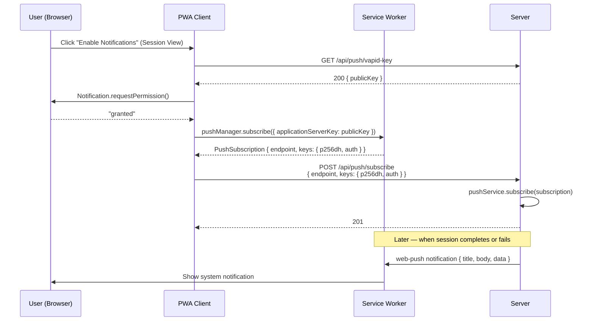

---

### Android Sign Request Flow

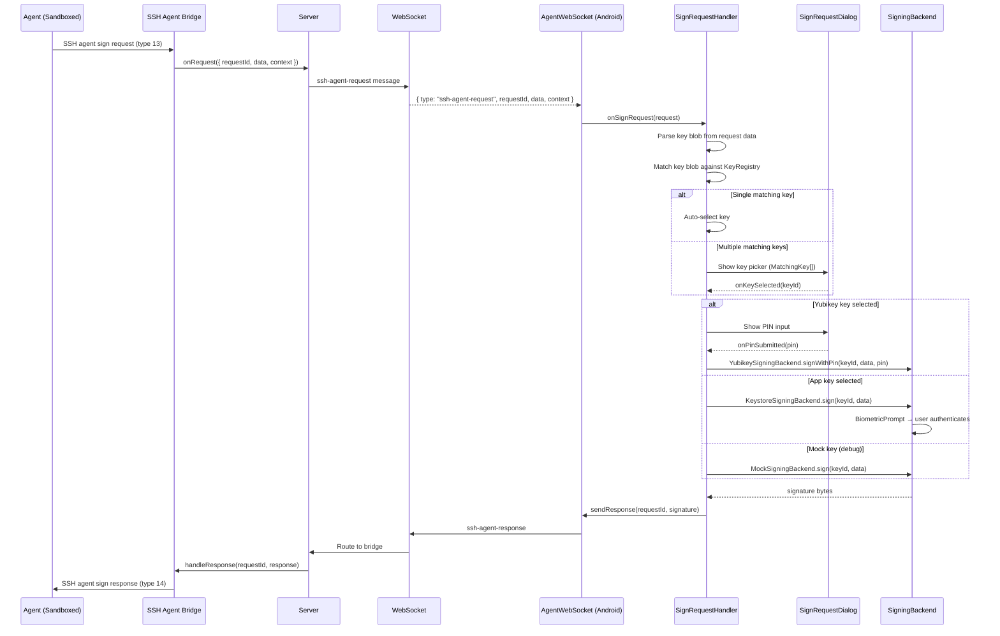

---

## Generated Files Reference

Files generated during the onboarding and interview process:

| File | Location | Generated By | Purpose |
|------|----------|-------------|---------|
| `transcript.md` | `<projectDir>/transcript.md` | Transcript parser (server-side) | Real-time conversation record from `output.jsonl`. Contains `## User` and `## Agent` sections. Tool calls are omitted. Append-only. |
| `interview-notes.md` | `<projectDir>/specs/<feature>/interview-notes.md` | Interview agent (Claude) | Agent-written summary of key decisions, rejected alternatives, and user priorities. Written when user signals readiness to plan. |
| `spec.md` | `<projectDir>/specs/<feature>/spec.md` | Interview agent (Claude) | Feature specification produced during the interview. |
| `flake.nix` | `<projectDir>/flake.nix` | Flake generator (onboarding pipeline) | Nix flake with stack-specific packages (node, python, rust, go, or generic). Uses detected host architecture. |

---

## Field Validation Reference Table

Every input field in the application, with client-side and server-side validation rules.

### User-Facing Input Fields

| Screen | Field | Required | Client Validation | Server Validation | Error Message |
|--------|-------|----------|-------------------|-------------------|---------------|
| New Project | Repository name | Yes | Button disabled when empty | Non-empty after trim; must match `/^[a-zA-Z0-9._-]+$/`; no duplicate in registry or filesystem | 400: "Missing or empty name for new project" / "Invalid project name: must contain only letters, numbers, dots, hyphens, underscores" / 409: "A project with name '{name}' already exists" |
| Dashboard (Onboard) | Git remote URL | No | Free-form text in GitRemoteModal | Validated by `git remote add` at execution time | Error surfaced via onboarding-step WebSocket |
| Add Feature | Describe the feature | Yes | Button disabled when empty | Non-empty after trim | 400: "Missing or empty description" |
| Session View | Type your answer... | Yes | Button disabled when empty or submitting | Non-empty after trim; session must be in `waiting-for-input` state | 400: "Empty answer" / 400: "Session is not in waiting-for-input state" |
| SpecKitChat | Type a message... | Yes | Send disabled when empty | Trim before WebSocket send | N/A (WebSocket, no HTTP error) |
| Settings | Log level (dropdown) | Yes | Predefined options: debug, info, warn, error, fatal | Must be one of the LOG_LEVELS set | 400: "Invalid level. Must be one of: debug, info, warn, error, fatal" |
| Settings | Voice backend (radio) | No | "browser" disabled if Web Speech unavailable; "cloud" disabled if `!health.cloudSttAvailable` | N/A (localStorage only) | N/A |
| Server Config (Android) | Server URL | Yes | Non-empty, valid HTTP/HTTPS URL | N/A (client-side only) | Inline error on TextInputLayout |
| Key Management (Android) | Key name (generate) | Yes | Non-empty | N/A (client-side only) | AlertDialog validation |
| Key Management (Android) | Key name (rename) | Yes | Non-empty | N/A (client-side only) | AlertDialog validation |
| Sign Request (Android) | PIN | Yes (Yubikey) | Non-empty | Verified by Yubikey PIV applet | Wrong PIN → retry; PIN blocked → auto-dismiss |

### Server-Side Implicit Validations

These are not user-typed fields but are validated on the server for each endpoint:

| Endpoint | Check | Error |
|----------|-------|-------|
| `POST /api/projects/onboard` | Name required when `newProject: true` | 400: "Missing or empty name for new project" |
| `POST /api/projects/onboard` | Name matches `/^[a-zA-Z0-9._-]+$/` when `newProject: true` | 400: "Invalid project name..." |
| `POST /api/projects/onboard` | Path required when `newProject: false` | 400: "Missing or invalid \"path\" field" |
| `POST /api/projects/onboard` | Path exists and is a directory | 400: "Path does not exist" / "Path is not a directory" |
| `POST /api/projects/onboard` | `remoteUrl` and `createGithubRepo` mutually exclusive | 400: "remoteUrl and createGithubRepo are mutually exclusive" |
| `POST /api/projects/onboard` | No duplicate (active project at same path/name) | 409: duplicate error |
| `POST /api/projects/:id/start-planning` | Project status is "onboarding" | 400: "Project status is \"...\", expected \"onboarding\"" |
| `POST /api/projects/:id/start-planning` | No active session (interview completed) | 409: "Project has an active session..." |
| `POST /api/projects/:id/add-feature` | Project exists | 404: "Project not found" |
| `POST /api/projects/:id/add-feature` | No active session | 409: "Project already has an active session" |
| `POST /api/projects/:id/add-feature` | Sandbox available | 503: sandbox error |
| `POST /api/projects/:id/sessions` | Valid type (`task-run` or `interview`) | 400: "Invalid or missing \"type\" field. Must be \"task-run\" or \"interview\"." |
| `POST /api/projects/:id/sessions` | Unchecked tasks remain (for task-run) | 400: "No unchecked tasks remaining" |
| `POST /api/projects/:id/sessions` | No active session | 409 (via `createSession`) |
| `POST /api/projects/:id/sessions` | Sandbox available | 503: sandbox error |
| `POST /api/sessions/:id/input` | Session exists | 404: "Session not found" |
| `POST /api/sessions/:id/stop` | Session exists | 404: "Session not found" |
| `POST /api/push/subscribe` | `endpoint` is non-empty string | 400: "Missing or invalid \"endpoint\" field" |
| `POST /api/push/subscribe` | `keys.p256dh` and `keys.auth` are strings | 400: "Missing or invalid \"keys\" field (requires p256dh and auth)" |
| `POST /api/projects` | `name` and `dir` are non-empty strings | 400: "Missing or invalid 'name' field" / "Missing or invalid 'dir' field" |
| `POST /api/projects` | No duplicate project | 409: duplicate error |
