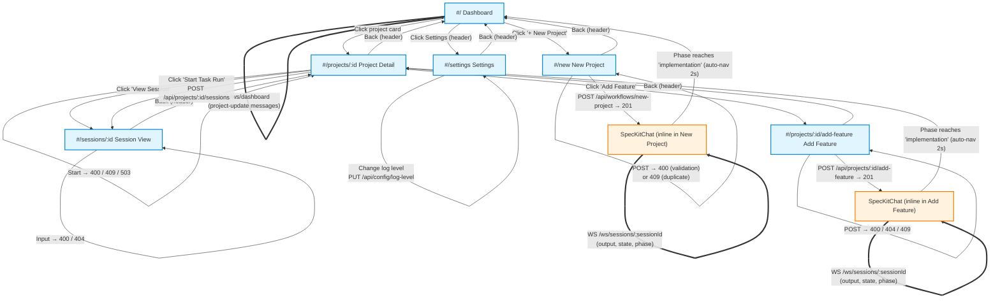
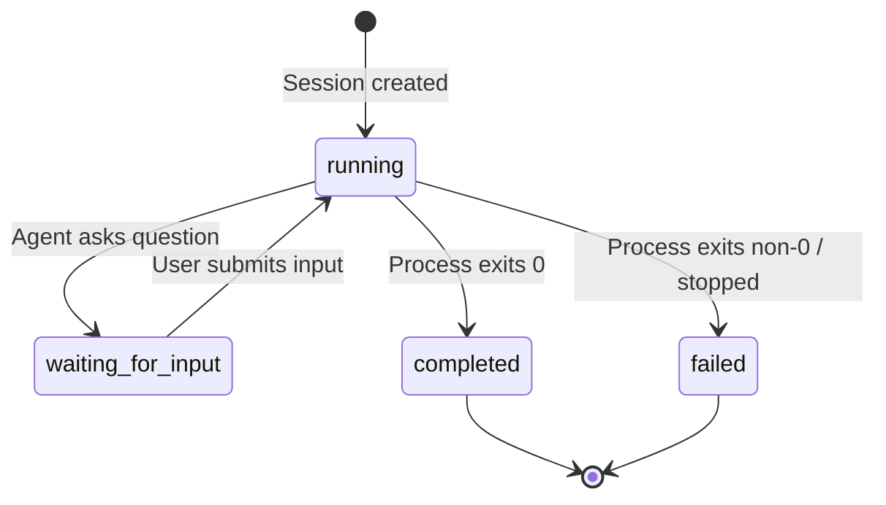
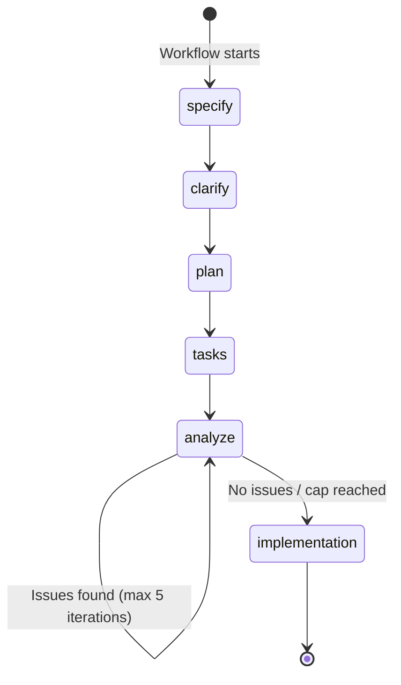

# UI Flow: Agent Runner

Authoritative reference for all screens, routes, API calls, WebSocket connections, state transitions, and field validations in the Agent Runner application.

## Main Flow Diagram

### Legend

| Style | Meaning |
|-------|---------|
| Solid arrow (`-->`) | User-triggered navigation or action |
| Dotted arrow (`-.->`) | On-load API call (GET) |
| Double-line arrow (`==>`) | WebSocket connection (persistent) |
| Blue boxes | Top-level screens (hash routes) |
| Orange boxes | Inline components (no route change) |

### Session State Machine

### Spec-Kit Workflow Phases

### API Endpoint Summary

| Method | Path | Used By | Purpose |
|--------|------|---------|---------|
| GET | `/api/health` | Settings | Server health, sandbox/STT availability |
| PUT | `/api/config/log-level` | Settings | Update server log level |
| GET | `/api/projects` | Dashboard | List all projects with task summaries |
| POST | `/api/projects` | (admin) | Register existing project directory |
| GET | `/api/projects/:id` | ProjectDetail | Full project info with tasks/sessions |
| DELETE | `/api/projects/:id` | (admin) | Unregister project |
| POST | `/api/projects/:id/sessions` | ProjectDetail | Start task-run or interview session |
| GET | `/api/projects/:id/sessions` | (API) | List sessions for a project |
| POST | `/api/projects/:id/add-feature` | AddFeature | Start add-feature workflow |
| POST | `/api/workflows/new-project` | NewProject | Start new-project workflow |
| GET | `/api/sessions/:id` | SessionView | Fetch session metadata |
| GET | `/api/sessions/:id/log` | SessionView | Fetch session log entries |
| POST | `/api/sessions/:id/stop` | ProjectDetail | Stop a running session |
| POST | `/api/sessions/:id/input` | SessionView | Submit input to waiting session |
| GET | `/api/push/vapid-key` | SessionView | Get VAPID public key |
| POST | `/api/push/subscribe` | SessionView | Subscribe to push notifications |
| POST | `/api/voice/transcribe` | (voice cloud) | Cloud speech-to-text transcription |

### WebSocket Paths

| Path | Used By | Messages Received |
|------|---------|-------------------|
| `/ws/dashboard` | Dashboard | `project-update` (projectId, activeSession, taskSummary, workflow) |
| `/ws/sessions/:id` | SessionView, SpecKitChat | `output`, `state`, `progress`, `phase`, `sync`, `error` |

---

## Screen-by-Screen Details

### Dashboard (`#/`)

**Route**: `#/` (default)
**Component**: `src/client/components/dashboard.tsx`

**On Load**:
- `GET /api/projects` — fetches all projects with task summaries and active session info

**User Actions**:
| Element | Action | Result |
|---------|--------|--------|
| "+ New Project" link | Click | Navigate to `#/new` |
| Project card | Click | Navigate to `#/projects/:id` |
| Settings icon (header) | Click | Navigate to `#/settings` |

**Field Validations**: None (read-only screen)

**Real-time Updates**:
- WebSocket `/ws/dashboard` — receives `project-update` messages containing:
  - `projectId`: which project changed
  - `activeSession`: current session state (id, type, state) or null
  - `taskSummary`: updated task counts (total, completed, blocked, skipped, remaining)
  - `workflow`: current workflow info (type, phase, iteration, description) or null

**Navigation Out**:
- `#/new` — create new project
- `#/projects/:id` — view project details
- `#/settings` — app settings

**Error States**:
- API fetch failure — error message displayed inline
- WebSocket disconnect — auto-reconnect with exponential backoff (500ms → 30s); non-fatal

---

### New Project (`#/new`)

**Route**: `#/new`
**Component**: `src/client/components/new-project.tsx`

**On Load**: None

**User Actions**:
| Element | Action | Result |
|---------|--------|--------|
| "Repository name" text input | Type | Sets `name` state |
| "Describe your idea" textarea | Type | Sets `description` state |
| Mic button (M) | Click | Starts voice transcription → fills description field |
| "Start Project" button | Click | `POST /api/workflows/new-project` with `{ name, description }` |
| Back (header) | Click | Navigate to `#/` |

**Field Validations**:
- `name`: required, non-empty (button disabled until filled)
- `description`: required, non-empty (button disabled until filled)
- Server-side: name must match `/^[a-zA-Z0-9._-]+$/`, must not be duplicate

**Real-time Updates**:
- After workflow starts, transitions to inline SpecKitChat component
- SpecKitChat connects to `WS /ws/sessions/:sessionId`
- Receives: `output` (log lines), `state` (session state changes), `phase` (workflow phase transitions)
- Phase indicator shows: specify → clarify → plan → tasks → analyze progression

**Navigation Out**:
- `#/` — back via header
- `#/` — auto-navigation when workflow phase reaches "implementation" (2s delay)

**Error States**:
- 400 — validation error (empty name, invalid chars, empty description) — displayed inline
- 409 — duplicate project name — displayed inline
- 503 — sandbox unavailable — displayed inline
- Voice transcription failure — graceful fallback, user can type instead

---

### Project Detail (`#/projects/:id`)

**Route**: `#/projects/:id`
**Component**: `src/client/components/project-detail.tsx`

**On Load**:
- `GET /api/projects/:id` — fetches project with tasks, sessions, task summary, active session

**User Actions**:
| Element | Action | Result |
|---------|--------|--------|
| "Start Task Run" button | Click | `POST /api/projects/:id/sessions` with `{ type: "task-run" }` → navigate to `#/sessions/:newId` |
| "Stop" button | Click | `POST /api/sessions/:id/stop` → session marked failed |
| "View Session" button | Click | Navigate to `#/sessions/:id` |
| "Add Feature" button | Click | Navigate to `#/projects/:id/add-feature` |
| Back (header) | Click | Navigate to `#/` |

**Field Validations**:
- "Start Task Run" disabled when `taskSummary.remaining === 0`
- "Stop" only visible when `activeSession.state === 'running'`

**Real-time Updates**: None (uses polling via `fetchProject()` after actions)

**Navigation Out**:
- `#/` — back to dashboard
- `#/sessions/:id` — view session (via "View Session" or after starting task run)
- `#/projects/:id/add-feature` — add feature workflow

**Error States**:
- 404 — project not found
- 400 — no unchecked tasks remaining (for start)
- 409 — project already has active session (for start)
- 503 — sandbox unavailable (for start)
- Stop errors displayed inline

---

### Session View (`#/sessions/:id`)

**Route**: `#/sessions/:id`
**Component**: `src/client/components/session-view.tsx`

**On Load**:
- `GET /api/sessions/:id` — fetch session metadata (state, type, projectId, question, etc.)
- `GET /api/sessions/:id/log` — fetch existing log entries before WebSocket subscription

**User Actions**:
| Element | Action | Result |
|---------|--------|--------|
| "Enable Notifications" button | Click | `GET /api/push/vapid-key` → browser `Notification.requestPermission()` → `POST /api/push/subscribe` |
| Answer text input + Enter / "Submit" | Submit | `POST /api/sessions/:id/input` with `{ answer }` |
| Scroll output area | Scroll up | Disables auto-scroll; auto-scroll re-enables at bottom |

**Field Validations**:
- Answer input: required, non-empty after trim
- Submit disabled when input empty or already submitting

**Real-time Updates**:
- WebSocket `WS /ws/sessions/:id?lastSeq=N`
- Receives:
  - `output` — log lines (seq, timestamp, stream: stdout/stderr/system, content)
  - `state` — session state changes (state, question, taskId)
  - `progress` — task summary updates
  - `sync` — sequence sync after replay

**Navigation Out**:
- `#/projects/:projectId` — back via header (uses projectId from session metadata)

**Error States**:
- 404 — session not found
- 400 — session not in waiting-for-input state (for input submission)
- 400 — empty answer
- Push notification: unsupported/denied/error states shown to user
- WebSocket disconnect — auto-reconnect with seq-based replay

---

### Add Feature (`#/projects/:id/add-feature`)

**Route**: `#/projects/:id/add-feature`
**Component**: `src/client/components/add-feature.tsx`

**On Load**: None

**User Actions**:
| Element | Action | Result |
|---------|--------|--------|
| "Describe the feature" textarea | Type | Sets `description` state |
| Mic button (M) | Click | Starts voice transcription → fills description field |
| "Add Feature" button | Click | `POST /api/projects/:id/add-feature` with `{ description }` |
| Back (header) | Click | Navigate to `#/projects/:id` |

**Field Validations**:
- `description`: required, non-empty (button disabled until filled)
- Server-side: project must exist, must not have active session

**Real-time Updates**:
- After workflow starts, transitions to inline SpecKitChat component
- SpecKitChat connects to `WS /ws/sessions/:sessionId`
- Receives: `output`, `state`, `phase` messages
- Phase indicator shows: specify → clarify → plan → tasks → analyze progression

**Navigation Out**:
- `#/projects/:id` — back via header
- `#/projects/:id` — auto-navigation when workflow phase reaches "implementation" (2s delay)

**Error States**:
- 400 — empty description — displayed inline
- 404 — project not found — displayed inline
- 409 — project already has active session — displayed inline
- 503 — sandbox unavailable — displayed inline
- Voice transcription failure — graceful fallback

---

### Settings (`#/settings`)

**Route**: `#/settings`
**Component**: `src/client/components/settings.tsx`

**On Load**:
- `GET /api/health` — fetch server status (uptime, sandboxAvailable, cloudSttAvailable)

**User Actions**:
| Element | Action | Result |
|---------|--------|--------|
| Voice backend radio (browser/cloud) | Select | Sets voice backend in voice.ts module state |
| Log level dropdown | Change | `PUT /api/config/log-level` with `{ level }` |
| "Enable Notifications" button | Click | `Notification.requestPermission()` (browser API) |
| Back (header) | Click | Navigate to `#/` |

**Field Validations**:
- Voice backend radio: "browser" disabled if `!isBrowserSpeechAvailable()`, "cloud" disabled if `!health.cloudSttAvailable`
- Log level: must be one of debug, info, warn, error, fatal

**Real-time Updates**: None

**Navigation Out**:
- `#/` — back to dashboard

**Error States**:
- Health fetch failure — error message, loading indicator persists
- Log level update failure — error displayed inline
- Push notification denied — status shown to user

---

### SpecKitChat (Shared Inline Component)

**Route**: None (inline within New Project and Add Feature)
**Component**: `src/client/components/spec-kit-chat.tsx`

**On Load**:
- Connects to `WS /ws/sessions/:sessionId` immediately

**User Actions**:
| Element | Action | Result |
|---------|--------|--------|
| Text input + Enter / "Send" button | Submit | Sends `{ type: "input", content }` via WebSocket |
| Mic button (M) | Click | Starts voice transcription → fills input field |
| Scroll output area | Scroll up | Disables auto-scroll |

**Field Validations**:
- Input: required, non-empty after trim
- Send disabled when input empty

**Real-time Updates**:
- WebSocket `WS /ws/sessions/:sessionId`
- Receives:
  - `output` — log lines with stream coloring (stdout=default, stderr=red, system=blue)
  - `state` — state changes; shows question banner when `waiting-for-input`
  - `phase` — phase transitions; updates phase indicator; may update sessionId for new phase session

**Navigation Out**:
- Parent screen's completion route when phase becomes "implementation" (2s auto-nav delay)

**Error States**:
- WebSocket disconnect — auto-reconnect with exponential backoff
- Message parse errors — silently ignored
