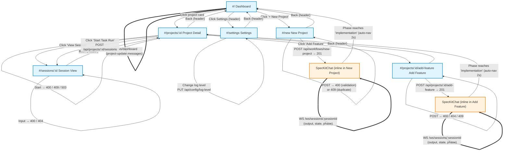
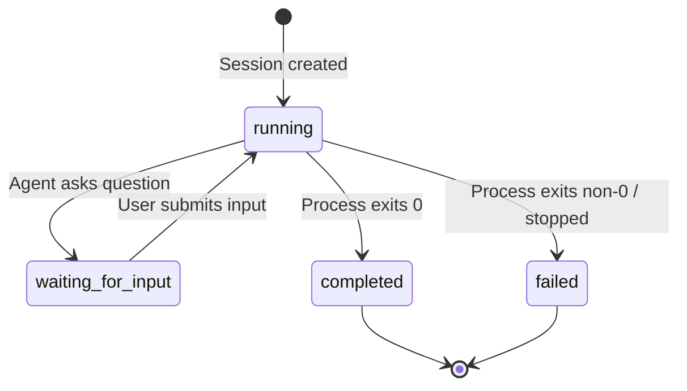
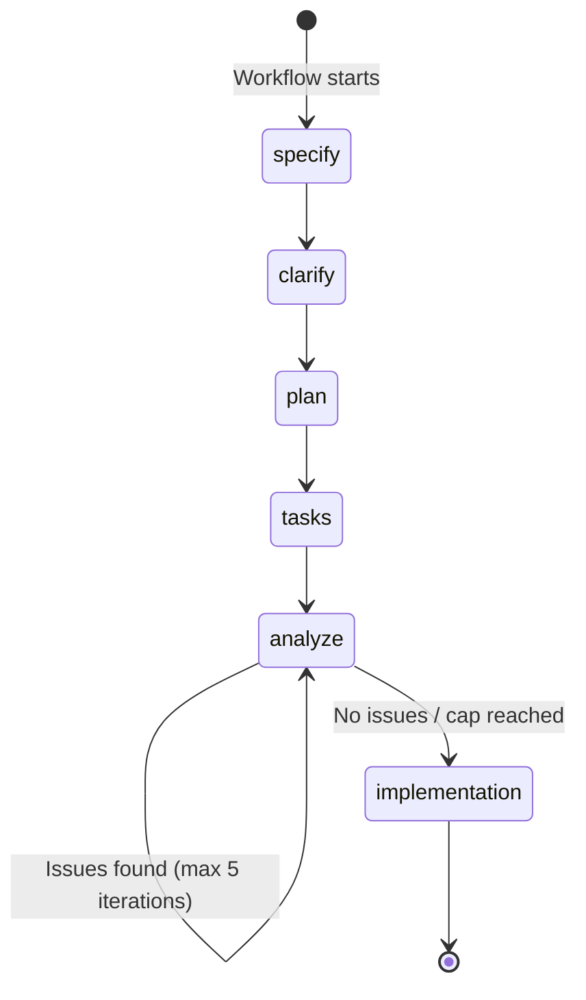

# UI Flow: Agent Runner

Authoritative reference for all screens, routes, API calls, WebSocket connections, state transitions, and field validations in the Agent Runner application.

## Main Flow Diagram

### Legend

| Style | Meaning |
|-------|---------|
| Solid arrow (`-->`) | User-triggered navigation or action |
| Dotted arrow (`-.->`) | On-load API call (GET) |
| Double-line arrow (`==>`) | WebSocket connection (persistent) |
| Blue boxes | Top-level screens (hash routes) |
| Orange boxes | Inline components (no route change) |

### Session State Machine

### Spec-Kit Workflow Phases

### API Endpoint Summary

| Method | Path | Used By | Purpose |
|--------|------|---------|---------|
| GET | `/api/health` | Settings | Server health, sandbox/STT availability |
| PUT | `/api/config/log-level` | Settings | Update server log level |
| GET | `/api/projects` | Dashboard | List all projects with task summaries |
| POST | `/api/projects` | (admin) | Register existing project directory |
| GET | `/api/projects/:id` | ProjectDetail | Full project info with tasks/sessions |
| DELETE | `/api/projects/:id` | (admin) | Unregister project |
| POST | `/api/projects/:id/sessions` | ProjectDetail | Start task-run or interview session |
| GET | `/api/projects/:id/sessions` | (API) | List sessions for a project |
| POST | `/api/projects/:id/add-feature` | AddFeature | Start add-feature workflow |
| POST | `/api/workflows/new-project` | NewProject | Start new-project workflow |
| GET | `/api/sessions/:id` | SessionView | Fetch session metadata |
| GET | `/api/sessions/:id/log` | SessionView | Fetch session log entries |
| POST | `/api/sessions/:id/stop` | ProjectDetail | Stop a running session |
| POST | `/api/sessions/:id/input` | SessionView | Submit input to waiting session |
| GET | `/api/push/vapid-key` | SessionView | Get VAPID public key |
| POST | `/api/push/subscribe` | SessionView | Subscribe to push notifications |
| POST | `/api/voice/transcribe` | (voice cloud) | Cloud speech-to-text transcription |

### WebSocket Paths

| Path | Used By | Messages Received |
|------|---------|-------------------|
| `/ws/dashboard` | Dashboard | `project-update` (projectId, activeSession, taskSummary, workflow) |
| `/ws/sessions/:id` | SessionView, SpecKitChat | `output`, `state`, `progress`, `phase`, `sync`, `error` |
